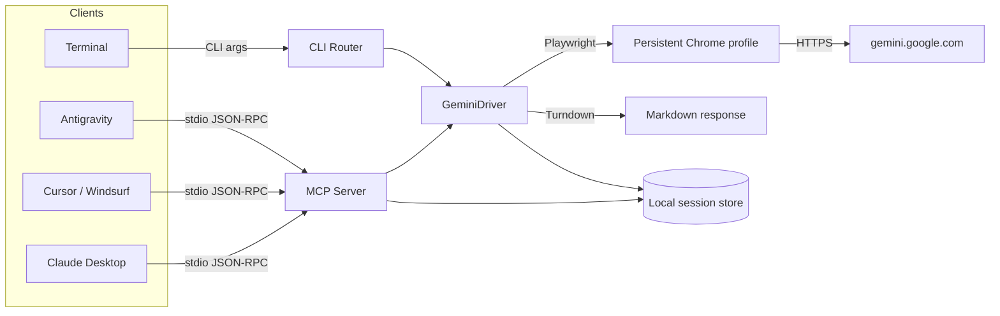

# Gemini Web MCP

Use your real Google Gemini web session inside AI coding agents and your terminal.

[](https://www.npmjs.com/package/gemini-website-mcp)
[](https://github.com/AkashNaickar/gemini-web-mcp/actions/workflows/ci.yml)
[](https://github.com/AkashNaickar/gemini-web-mcp/actions/workflows/gitleaks.yml)
[](LICENSE)
[](package.json)

Most Gemini wrappers require credit cards or paid API keys and often deal with restricted model tiers that strip out web grounding, Canvas, code execution, and Workspace integrations.

`gemini-web-mcp` bridges your AI coding assistants (Claude Desktop, Cursor, Windsurf, Antigravity) and your terminal directly to the real `gemini.google.com` interface using your existing Google account.

> **No hosted demo.** This project is a local CLI + stdio MCP server; there is no web UI or public URL to click. The closest equivalent to a demo is the install command:
>
> ```bash
> npx -y gemini-website-mcp login
> npx -y gemini-website-mcp chat
> ```

---

## Contents

- [What it does](#what-it-does)
- [Quick start](#quick-start)
- [Hooking into AI coding agents](#hooking-into-ai-coding-agents)
- [CLI commands](#cli-commands)
- [Available MCP tools](#available-mcp-tools)
- [How it works](#how-it-works)
- [Environment variables](#environment-variables)
- [Development](#development)
- [Testing](#testing)
- [Roadmap](#roadmap)
- [Contributing](#contributing)
- [License](#license)

---

## What it does

- **Direct web access**: lets your agent use live Google Search grounding, the Python code runner, and document upload features from the real web UI.
- **No API key handling**: authenticate once in a real browser window; the session cookies stay on your own disk.
- **Thread memory**: keeps conversation context across turns via a local session file.
- **Works via `npx`**: no need to clone the repo or build anything.
- **Open MCP standard**: connects to any Model Context Protocol client over stdio.

## Quick start

### 1. Log in once

```bash
npx -y gemini-website-mcp login
```

A Chrome window opens. Sign into your Google account (including 2FA if enabled). Once the Gemini chat box is visible, return to the terminal and press `Enter`. The session is saved locally under `~/.gemini-web-mcp/` (override with `USER_DATA_DIR`).

### 2. Chat from your terminal

```bash
npx -y gemini-website-mcp chat
```

Or send a one-off prompt that continues the previous thread:

```bash
npx -y gemini-website-mcp ask "Summarize the latest Gemini release notes"
```

## Hooking into AI coding agents

Add the server to your agent's MCP config file.

### Antigravity (`~/.gemini/config/mcp_config.json`)

```json
{
  "mcpServers": {
    "gemini-web": {
      "command": "gemini-website-mcp"
    }
  }
}
```

### Claude Desktop (`claude_desktop_config.json`)

- **macOS**: `~/Library/Application Support/Claude/claude_desktop_config.json`
- **Windows**: `%APPDATA%\Claude\claude_desktop_config.json`

```json
{
  "mcpServers": {
    "gemini-web": {
      "command": "npx",
      "args": ["-y", "gemini-website-mcp"]
    }
  }
}
```

### Cursor (`.cursor/mcp.json`)

```json
{
  "mcpServers": {
    "gemini-web": {
      "command": "npx",
      "args": ["-y", "gemini-website-mcp"]
    }
  }
}
```

## CLI commands

Both `gemini-web-mcp` and the longer `gemini-website-mcp` are installed as binaries and behave identically.

| Command | Description |
| :--- | :--- |
| `gemini-web-mcp login` | Opens a browser for one-time Google login |
| `gemini-web-mcp chat` | Starts the real-time multi-turn terminal chat REPL |
| `gemini-web-mcp ask "<prompt>"` | Asks a question, continuing the last conversation |
| `gemini-web-mcp ask --new "<prompt>"` | Starts a fresh conversation thread |
| `gemini-web-mcp link` | Prints the web link for the active thread |
| `gemini-web-mcp open` | Opens the current thread in your default browser |
| `gemini-web-mcp status` | Verifies your session auth status |
| `gemini-web-mcp --version` | Prints the installed version |
| `gemini-web-mcp` (no args) | Starts the MCP server on stdio |

## Available MCP tools

When an agent connects to the MCP server it gets these tools:

1. **`ask_gemini_web`** — sends a prompt to Gemini web, waits for streaming to finish, and returns clean Markdown.
   - `prompt` (string, required): the prompt text.
   - `new_chat` (boolean, optional): set `true` to force a new thread. Defaults to `false`.
   - `timeout_seconds` (number, optional): max wait time. Defaults to `60`.
2. **`gemini_upload_and_analyze`** — uploads a local file or image to Gemini for multimodal review.
   - `prompt` (string, required): instructions for analyzing the file.
   - `file_path` (string, required): path to the image or document.
   - `new_chat` (boolean, optional): defaults to `true`.
3. **`get_current_chat_url`** — returns the direct URL to the active conversation on `gemini.google.com`.
4. **`check_gemini_session_status`** — checks whether the local Google login is active.

## How it works



1. **Persistent browser session**: Playwright launches a background browser instance against a persistent profile directory (`~/.gemini-web-mcp/profile`).
2. **Stealth flags**: runs with anti-automation flags and user-agent handling so Google is less likely to flag the session.
3. **DOM stream observer**: watches the response container and detects when streaming stops, then converts the rendered HTML to GitHub-flavored Markdown with Turndown.
4. **Local-only data**: login cookies and conversation history never leave your machine.

## Environment variables

Optional overrides via environment variables or a local `.env` file (see `.env.example`):

| Variable | Default | Description |
| :--- | :--- | :--- |
| `USER_DATA_DIR` | `~/.gemini-web-mcp/profile` | Directory for the persistent browser profile and session cookies |
| `HEADLESS` | `true` | Run the browser headless; set to `false` to watch the window |
| `TIMEOUT_MS` | `60000` | Navigation and response timeout in milliseconds |
| `CHROME_EXECUTABLE_PATH` | auto-detected | Path to a custom Chrome/Chromium binary |
| `GEMINI_BASE_URL` | `https://gemini.google.com/app` | Base Gemini URL |
| `USER_AGENT` | browser default | Override the Playwright user agent |

## Development

```bash
git clone https://github.com/AkashNaickar/gemini-web-mcp.git
cd gemini-web-mcp
npm install
npx playwright install chromium
npm run build
npm link            # optional: expose the gemini-web-mcp command locally
```

Scripts:

| Script | Description |
| :--- | :--- |
| `npm run dev` | Run the CLI directly from TypeScript via tsx |
| `npm run build` | Compile `src/` to `dist/` with `tsc` |
| `npm run typecheck` | Type-check `src/` and `test/` without emitting |
| `npm test` | Run the unit test suite |
| `npm run login` | Authenticate a Google account |
| `npm run chat` | Start the interactive chat REPL |

## Testing

```bash
npm run typecheck   # src + test
npm test            # 31 unit tests over argv parsing, config resolution and URL handling
```

The test suite targets pure logic only (argument parsing, environment/profile resolution, and safe URL opening); anything that needs a real browser session is exercised manually via `npm run chat`.

To verify the MCP stdio handshake after building:

```bash
echo '{"jsonrpc":"2.0","id":1,"method":"initialize","params":{"protocolVersion":"2024-11-05","capabilities":{},"clientInfo":{"name":"test","version":"1.0.0"}}}' | npm start
```

## Roadmap

- [ ] Optional response streaming events exposed over MCP.
- [ ] Broader selector coverage for Gemini UI changes.
- [ ] Configurable conversation history retention.

## Contributing

Contributions are welcome. See [CONTRIBUTING.md](CONTRIBUTING.md); keep TypeScript building clean (`npm run typecheck`) and tests green (`npm test`) before opening a PR.

## License

MIT © 2026 Akash Naickar. See [LICENSE](LICENSE).
